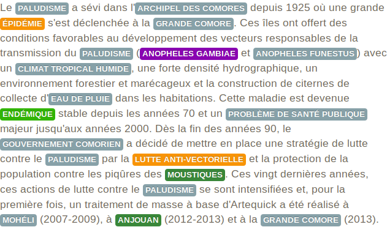

# Indexation automatique de publications

__Fevrier 2020 -- Beye, Qohafa, Neverov__

## Introduction 

Le conservation et le partage des ressources scientifiques issues de la recherche est aujourd'hui encore
une vraie problématique pour les services d'information scientifique et technique (IST). 
En effet l'indexation des publications est faite de manière manuelle alors que les données augmentent jour après jour.
Grâce à L'IA et notamment aux techniques de _traitement naturel du langage_, nous avons mis en place un outil d'indexation automatique de documents scientifiques issues de Agritrop, l'archive ouverte des publications de Cirad. 
Les outils que nous avons mis en place sont [GROBID](https://github.com/kermitt2/grobid) et [entity-fishing](https://github.com/kermitt2/entity-fishing).
Ce sont des logiciels open source qui permettent d'appliquer le machine learning a la recherche d'information dans les publications scientifiques non structurées. 

Dans l'archive ouverte du Cirad, l'indexation s'est faite jusque là à la main. 
La problematique est donc d'extraire des mots clés ainsi que des entités geographiques des publication non structurées (sous format `pdf`).
Le but final de cette démarche est de faciliter la consultation et la recherche documentaire dans l'archive. 

## GROBID

GROBID (GeneRation Of BIbliographic Data) est une librairie de machine learning qui permet de parser des publications scientifiques sous le format `pdf` et de le transformer au format `xml` TEI.
Elle est implémentée en java et met a disposition un service REST. 
Aujourd'hui GROBID est utilise en production dans des grandes archives scientifiques comme HAL et ResearchGate.

## Entity-fishing

Entity-fishing est un outil developpé par les mêmes auteurs que GROBID et sont etroitement liés.
Par exemple entity-fishing necessite GROBID et GROBID-NER (Named Entity Recognition) pour fonctionner.
Cet outil dispose aussi d'une API REST que nous avons utilisé, il dispose de differents modèles pour les principaux languages européens.
Ceux-ci sont entrainés sur Wikipédia et ne sont donc pas tout à fait adaptés au domaine de l'agronomie.

Voici un exemple de sortie dans la webapp de démonstration:

	

## Deploiement

## Documentation

L'indexation automatique a été faite avec des mots clés issus de Agrovoc. 
En effet Agritrop identifie et décrit les ressources qu'il héberge 

## Conclusion

On a donc

## Bibliographie